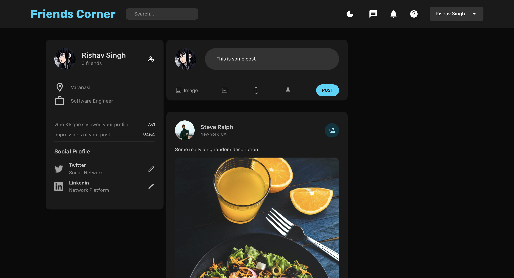
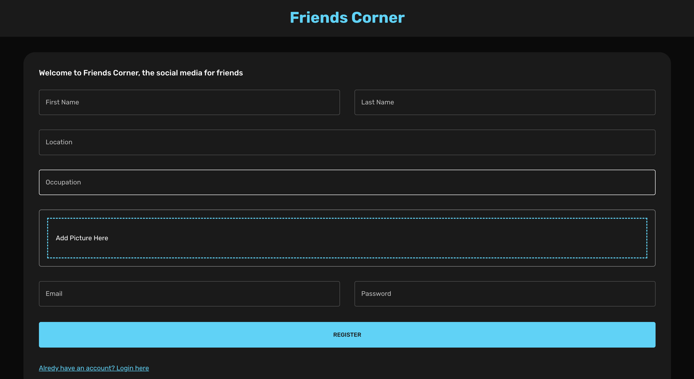

# Friends-Corner Social Media Project

### Friends-Corner is a small social media project that allows users to create accounts, post pictures and text, make friends, and interact with each other. The project is similar to Facebook but on a much smaller scale.

**Technologies Used**

- Node.js
- Express.js
- MongoDB
- HTML
- CSS
- JavaScript

#### Features

- **User Registration and Login:** Users can create their accounts and login to the platform.
- **Profile Management:** Users can manage their profiles and update their personal information.
- **Posting:** Users can post pictures and text on their profiles.
- **Friend System:** Users can make friends with other users and view their friends' posts.
- **News Feed:** Users can view posts from their friends on their news feed.

#### Getting Started

Clone the repository to your local machine using _"git clone https://github.com/RishaV107/FirendsCorner.git"_

- Install the dependencies by running npm install
- Start the server using npm start
- Open localhost:3000 in your browser to view the application

#### Contributing

Contributions to the project are always welcome. If you find a bug or have a feature request, please create an issue on GitHub. If you would like to contribute to the project, please create a pull request.

#### Sample Images

##### Screen 1

##### Screen 2

- 
